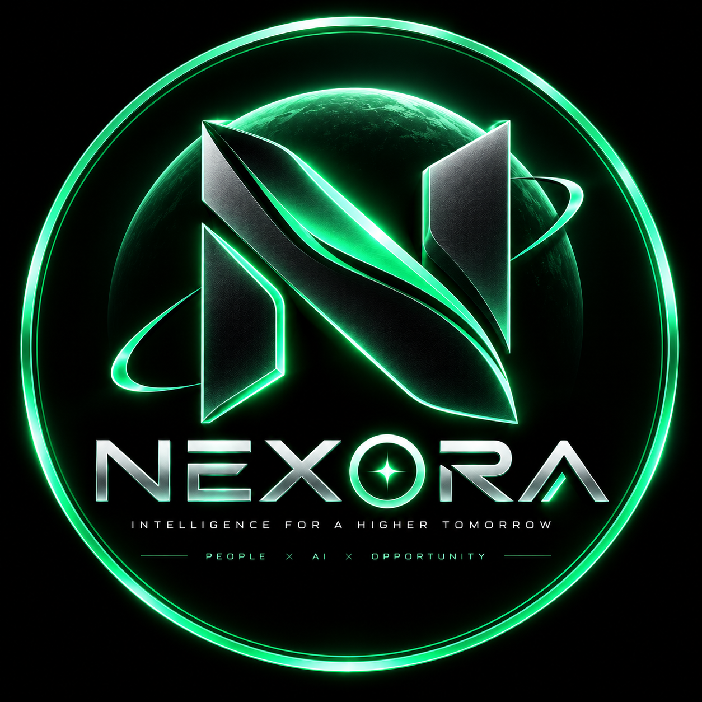

# NEXORA

> **Intelligence for a Higher Tomorrow.**

NEXORA is an independent project exploring the next layer of intelligent technology, onchain systems, and community-driven innovation.

> AI × TECHNOLOGY × ONCHAIN

## Project Areas

- AI intelligence and useful interfaces
- Onchain technology and verifiable coordination
- Digital ecosystems for builders and communities
- Configurable holder participation and reward systems

## Token Information

Token name: `NEXORA`

Token symbol: `NEXORA`

Contract address: **To be published through official channels**

Network: **To be confirmed**

The token details above are intentionally left configurable until official deployment information is confirmed. Do not rely on unofficial contract addresses.

## Official Links

- Website: **To be added**
- Community: **To be added**
- X / Twitter: **To be added**

## Development

This repository is the official home for Nexora project documentation, public resources, and future technical releases.

## Disclaimer

NEXORA is an independent project. It is not affiliated with, endorsed by, or sponsored by NVIDIA Corporation. “NVDA” refers only to the NVIDIA stock ticker when used in the context of the project's holder category. Nothing in this repository constitutes financial advice, a promise of returns, or a guarantee of rewards.

Reward mechanisms, eligibility rules, percentages, and technical details are configurable and subject to official publication.

## License

Unless otherwise stated, project materials are provided for informational purposes. See `LICENSE` for the repository license notice.
